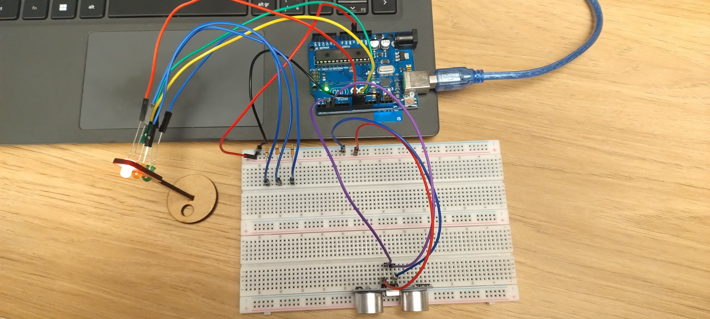
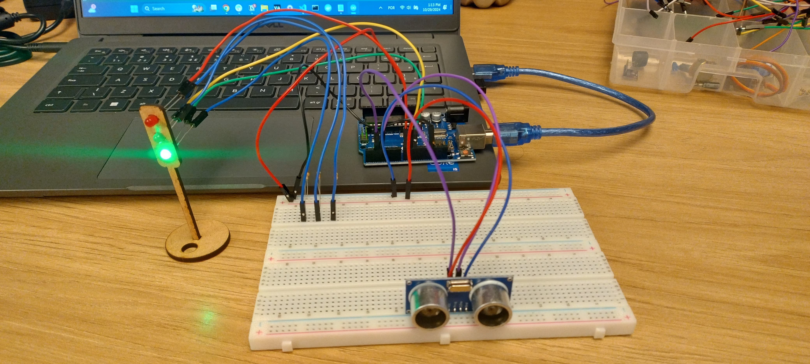

# Ponderada de Programação - Semáforo Off-line

Esta atividade ponderada foi realizada pela aluna Kethlen Martins da Silva (ateliê 1) para a disciplina de Programação, cuja professora instrutora é Kizzy Terra. A ponderada faz parte do módulo 4 (projeto de IoT) do Instituto de Tecnologia e Liderança e contém as seguintes entregas:

1. Entrega de vídeo do semáforo funcionando;
2. Entrega de foto do circuito e ligações na protoboard;
3. Relato de experiência;
4. Tabela de especifições de componentes;
5. Avaliação em pares.

## Relato de experiência

Para criar o sistema, utilizei uma protoboard e conectei os leds, resistores e o sensor ultrassônico. Depois disso, liguei os terminais positivo (5v) e negativo (GND) da protoboard ao Arduino Uno. Por fim, liguei os componentes nos terminais digitais do Arduino.

A ideia do sensor ultrassônico, pelo projeto ser um semáforo, é que, sempre que um pedestre passasse na frente do semáforo e ele estivesse aberto, ele fecharia automaticamente para que não ocorram acidentes e atropelamentos.

## Vídeo do semáforo

## Fotos do circuito

Abaixo estão as fotos que demonstram as ligações do sistema.

    Circuito - foto 1   

  
   
   Fonte: Material produzido pelos autores (2024)

    Circuito - foto 2   

  
   
   Fonte: Material produzido pelos autores (2024)

## Tabela de especificações

| Componente | Quantidade | Descrição |
|---------------|--------|----------------|
| Led vermelho | 1 | Led que é utilizado como a luz vermelha do semáforo |
| Led amarelo | 1 | Led que é utilizado como a luz amarela do semáforo |
| Led verde | 1 | Led que é utilizado como a luz verde do semáforo |
| Resistor | 3 | Componentes utilizados para mediar e diminuir a corrente que passa pelos componentes |
| Sensor ultrassônico | 1 | Sensor de distância | | Arduino Uno | 1 | Microcontrolador que é conectado a uma IDE no computador e permite a programação para controle dos componentes |
| Cabo de alimentação | 1 | Cabo para ligação entre o arduino e o computador |
| Fios jumper | 12 | Fios para ligação entre componentes |

## Avaliação em pares

### Avaliador 1: Nicolas

| Critério                                                                                                 | Contempla (Pontos) | Contempla Parcialmente (Pontos) | Não Contempla (Pontos) | Observações do Avaliador |
|---------------------------------------------------------------------------------------------------------|--------------------|----------------------------------|--------------------------|---------------------------|
| Montagem física com cores corretas, boa disposição dos fios e uso adequado de resistores                | Até 3              | Até 1,5                            | 0                        |   O fios foram bem utilizados, e as cores são fáceis indentificadores da conexão de 5V (Vermelho), GND (Preto), Outputs (Amarelo) - 3,0                        |
| Temporização adequada conforme tempos medidos com auxílio de algum instrumento externo                  | Até 3              | Até 1,5                          | 0                        |   O semáforo está adequadamente temporizado, seguindo o comando da ponderada na adalove. - 3,0                        |
| Código implementa corretamente as fases do semáforo e estrutura do código (variáveis representativas e comentários) | Até 3              | Até 1,5                          | 0                        |   Código bem estruturado e comentado, é facilmente compreensível. - 3,0                    |
| Extra: Implmeentou um componente de liga/desliga no semáforo e/ou usou ponteiros no código | Até 1              |  Até 0,5                         | 0                        |    A ideia de utilizar o sonar para identificar a presença de possíveis pedestres e impedir que o semáforo abra foi muito boa e bem implementada. - 1,0                       |
| | | | |**Pontuação Total 10,0**| 

### Avaliador 2: Marcelo Rossignolli

| Critério                                                                                                 | Contempla (Pontos) | Contempla Parcialmente (Pontos) | Não Contempla (Pontos) | Observações do Avaliador |
|---------------------------------------------------------------------------------------------------------|--------------------|----------------------------------|--------------------------|---------------------------|
| Montagem física com cores corretas, boa disposição dos fios e uso adequado de resistores                | Até 3              | Até 1,5                            | 0                        |Os resistores estão sendo usados corretamente entretanto, os fios não tem identação por led apenas por polo (negativo é azul e positivo é amarelo); 2,75                            |
| Temporização adequada conforme tempos medidos com auxílio de algum instrumento externo                  | Até 3              | Até 1,5                          | 0                        |A temporização está no tempo certo; 3                           |
| Código implementa corretamente as fases do semáforo e estrutura do código (variáveis representativas e comentários) | Até 3              | Até 1,5                          | 0                        |O código está estruturado e comentado da forma correta; 3                            |
| Extra: Implmeentou um componente de liga/desliga no semáforo e/ou usou ponteiros no código | Até 1              |  Até 0,5                         | 0                        |Implementou um sensor ultrasônico que verifica se há a existência de algum obejto na frente dele, caso houver, ficará vermelho automaticamente; 1                            |
|  |              |  | |**Pontuação Total 9,75**| 